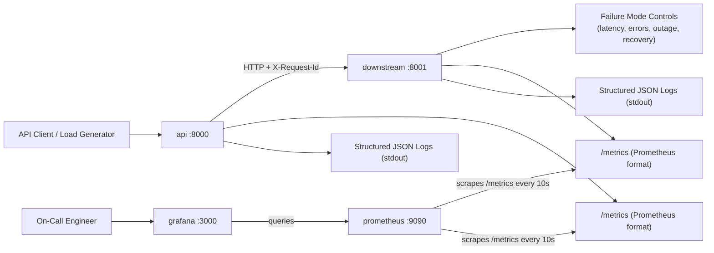

# Architecture

## Overview

The Observability & Incident Triage Demo Platform is a four-service Docker Compose stack that demonstrates a complete production-shaped observability pattern: an instrumented backend API, a controllable downstream dependency, a Prometheus scrape server, and Grafana with provisioned dashboards.

It is designed to be presented as a Sales Engineering walkthrough: customer pain (incident detection and triage), architecture, the dashboards, live incident scenarios, and the implementation path.

The platform runs locally through `docker compose up`. No cloud deployment is required to demo it.

---

## System Diagram

---

## Services

### `api` (port 8000)

The customer-facing trading API.

Responsibilities:

- Authenticate-free demo surface (accounts, orders, market data, admin) for the SE story
- Validate incoming request payloads (Pydantic + FastAPI)
- Generate or propagate a `X-Request-Id` per request, bound to structlog context
- Emit structured JSON logs for every request and significant event
- Expose Prometheus metrics at `/metrics`
- Call the downstream pricing/risk service over HTTP with bounded timeouts
- Normalize downstream failure responses into actionable error payloads

### `downstream` (port 8001)

A simulated downstream pricing and risk service used to drive realistic incident scenarios.

Responsibilities:

- Serve pricing and margin data
- Accept the same `X-Request-Id` header for distributed-trace continuity
- Expose Prometheus metrics at `/metrics`
- Provide controllable failure modes (`latency`, `errors`, `outage`, `recovery`)

### `prometheus` (port 9090)

Time-series database that scrapes the `/metrics` endpoint of both apps every 10 seconds.

### `grafana` (port 3000)

Visualization layer with provisioned Prometheus datasource and four pre-built dashboards.

---

## REST Surface

### `api`

| Method | Path | Calls Downstream? | Purpose |
| ------ | ---- | :--: | --- |
| GET    | `/health` | no | Service liveness |
| GET    | `/metrics` | no | Prometheus scrape target |
| GET    | `/docs` | no | Swagger UI |
| GET    | `/accounts/{id}` | no | Account details |
| GET    | `/accounts/{id}/positions` | **yes (N calls)** | Positions enriched with live downstream prices |
| GET    | `/accounts/{id}/orders` | no | Order history |
| POST   | `/orders` | no | Submit a new order |
| GET    | `/orders/{id}` | no | Single order |
| GET    | `/market/quote/{symbol}` | yes | Live pricing quote |
| GET    | `/market/status` | no | Market session info |
| POST   | `/admin/risk-check` | yes | Margin + position-size checks |

The `positions` endpoint makes N sequential downstream calls (one per position held). That fan-out is the source of the cascade scenario in `incident-scenarios.md` — by design.

### `downstream`

| Method | Path | Purpose |
| ------ | ---- | --- |
| GET    | `/health` | Service liveness |
| GET    | `/metrics` | Prometheus scrape target |
| GET    | `/pricing/quote/{symbol}` | Pricing source of truth |
| GET    | `/risk/account/{id}/margin` | Margin position lookup |
| POST   | `/simulate/latency` | Inject configurable latency |
| POST   | `/simulate/errors` | Inject configurable error rate |
| POST   | `/simulate/outage` | 100% 503 |
| POST   | `/simulate/recovery` | Reset to normal |
| GET    | `/simulate/status` | Current simulation state |

---

## Request Flow with Tracing

```mermaid
sequenceDiagram
  participant Client as API Client
  participant API as api
  participant Down as downstream
  participant Prom as prometheus
  participant Graf as grafana

  Client->>API: GET /market/quote/AAPL
  API->>API: request_context middleware<br/>generate or propagate X-Request-Id
  API->>API: bind request_id to structlog context
  API->>API: metrics middleware: start timer

  API->>Down: GET /pricing/quote/AAPL<br/>X-Request-Id: <same id>
  Down->>Down: apply_simulation() (latency/errors/outage)
  Down-->>API: 200 OK quote payload
  API->>API: increment downstream_requests_total{target=pricing,status=success}

  API-->>Client: 200 OK quote payload<br/>X-Request-Id: <same id>
  API->>API: log request.completed (with request_id)
  API->>API: record http_requests_total + duration histogram

  Note over Prom: every 10s
  Prom->>API: GET /metrics
  Prom->>Down: GET /metrics

  Note over Graf: every 10s (panel refresh)
  Graf->>Prom: PromQL query
```

---

## Metric Inventory

### Common (both services)

| Metric | Type | Labels |
| --- | --- | --- |
| `http_requests_total` | counter | `method`, `path` (route template), `status` |
| `http_request_duration_seconds` | histogram | `method`, `path` (route template) |
| `http_requests_in_flight` | gauge | — |

### api only

| Metric | Type | Labels |
| --- | --- | --- |
| `downstream_requests_total` | counter | `target` (pricing\|risk), `status` (success\|client_error\|server_error\|timeout\|connect_error) |
| `downstream_request_duration_seconds` | histogram | `target` |
| `orders_submitted_total` | counter | `side`, `symbol` |

The downstream metrics are what enable the "Is It Us Or Them?" panel and the entire dependencies-focused triage workflow.

---

## Configuration Model

All environment-specific behavior is driven by environment variables. No secrets are committed to source control.

`api`:

| Variable | Purpose |
| --- | --- |
| `PORT` | HTTP listen port (`8000`) |
| `SERVICE_NAME` | Identifier in logs |
| `ENV` | Runtime environment label |
| `DOWNSTREAM_BASE_URL` | Downstream service URL |
| `DOWNSTREAM_TIMEOUT_SECONDS` | httpx timeout (default `2`) |

`downstream`:

| Variable | Purpose |
| --- | --- |
| `PORT` | HTTP listen port (`8001`) |
| `SERVICE_NAME` | Identifier in logs |
| `ENV` | Runtime environment label |

Inside Docker Compose, `DOWNSTREAM_BASE_URL` is `http://downstream:8001` — services resolve each other by service name on the Compose network.

---

## Cross-Cutting Concerns

| Concern | Where It Lives |
| --- | --- |
| Request ID generation + propagation | `src/middleware/request_context.py` |
| Per-request metrics | `src/middleware/metrics.py` |
| Structured JSON logging | `src/logging_config.py` (structlog + stdlib bridge) |
| Downstream HTTP + timeouts | `src/services/downstream.py` (api only) |
| Downstream error normalization | `_normalize` in `src/services/downstream.py` |
| Failure-mode simulation | `src/simulation.py` (downstream only) |
| Prometheus metric definitions | `src/metrics.py` |
| Dashboard provisioning | `observability/grafana/provisioning/` |
| Scrape configuration | `observability/prometheus/prometheus.yml` |

---

## Design Decisions

| Decision | Reason |
| --- | --- |
| Two services on Docker Compose | Demonstrates real backend-to-SaaS-style dependency, including failure isolation. |
| Sequential downstream calls in `/positions` | Makes the fan-out cascade demoable. In production this would be parallelized. |
| In-memory data instead of a database | Keeps the demo focused on observability patterns. A DB would not strengthen the SE story. |
| Same metric *names* across both services | Lets dashboards use a single PromQL template and switch with the `job` label. |
| Path-template labels, not raw URLs | Prevents cardinality explosion. `/accounts/acct-001` and `/accounts/acct-002` collapse to `{account_id}`. |
| 2-second downstream timeout | Long enough for normal downstream latency, short enough that the timeout scenario is reachable in a demo. |
| Controllable failure modes via HTTP | Demos can be driven from a terminal in seconds, with no code changes. |
| Anonymous viewer access on Grafana | Lowers friction for interviewers / customers viewing the dashboards. |
| 1-hour Prometheus retention | Tiny disk footprint for the local demo. |
